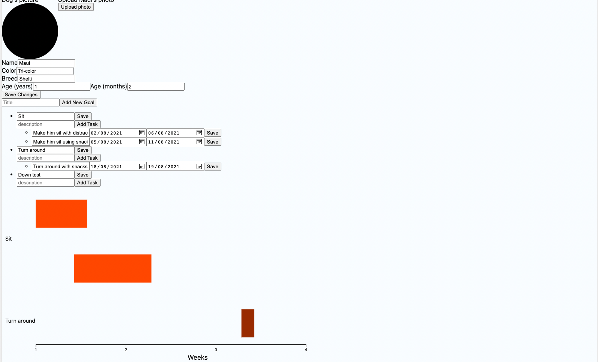

# MyWay 

This repository is for the client-side of the project. You can find the server side at [MyWay-server](https://github.com/zvikfir/MyWay-server).

## Introduction

MyWay (name was inspired by the author's dog - "Maui") is an open-source project which aims to serve as a Customer Management System (CMS) platform for dog trainers, helping them to keep track of their work with each customer, including abilities such as sending a summary of the last session directly to the customer, or plan the progress that needs to be made along the training sessions in a chart that is easy to use and read.

It is built using [Next.js](https://nextjs.org) (based on [React](https://reactjs.org)) and [tailwindcss](https://tailwindcss.com) in the frontend, [NestJS](https://nestjs.com) in the backend, and [PostgreSQL](https://www.postgresql.org) as the database.

## Contributing

This project needs you! If you're passionate about fullstack development, and would like to contribute some of your free time to make this project go live, feel free to contact me at <zvikfir10@gmail.com>. I will help you with setting up the environment and guide you towards your first PR in the project.

** **You don't have to know any of the technologies or libraries to contribute. You can learn from example and learn along the way.**

You can find detailed instructions on how to set up the environment yourself in the [Getting Started](#getting-started) section.

This project also needs graphic designers and/or UI/IX specialists who can consult about how to build the UI, and design it. If you're interested, feel free to make contact as well.

### Current Status

Below you will find a photo of a dog's page describing details about it, and in it there's a chart that is meant to serve as a way for dog trainers to plan training goals.

This photo is not up to date, but I think it demonstrates the purpose of this project well.



This is a [Next.js](https://nextjs.org/) project bootstrapped with [`create-next-app`](https://github.com/vercel/next.js/tree/canary/packages/create-next-app).

## Getting Started

Go to a folder in which you want to place the project.

Run the following:

```bash
mkdir MyWay
cd MyWay
git clone git@github.com:zvikfir/MyWay-client.git client
git clone git@github.com:zvikfir/MyWay-server.git server
```

To run the server:

```bash
cd server
npm install
npm run start:dev
```

To run the client:

```bash
cd client
npm install
npm run dev
```

Open [http://localhost:3000](http://localhost:3000) with your browser to see the result.

To set up the database, you need to [install PostgreSQL](https://www.postgresql.org/download/), and make sure you have a database called `myway`, and that you have the correct credentials set up in `server/ormconfig.json`. [TypeORM](https://typeorm.io) in development mode is configured to create the database tables for you.

## Directory Layout

On the `client`, important directories are:
* pages - Next.js automatically creates routes according to file names in this folder.
* components - a directory with all the React components which are not pages.
* services - contains the service layer of the application.
* stores - contains the [MobX](https://mobx.js.org/README.html) stores of the application ([Recommended reading to get you started](https://dev.to/zvikfir/next-js-nestjs-mobx-and-how-i-structured-my-open-source-project-5gco)).
* styles - contains globals.css file which affects the global styles in the application. Other styles are inlined using [tailwindcss](https://tailwindcss.com).
* libraries - includes common functions which are grouped into libraries.
* dto - contains DTOs used in the application.

On the `server`, the guidelines documented in the [NestJS documentation](https://docs.nestjs.com) are kept.

## License

This project is [MIT licensed](./LICENSE).